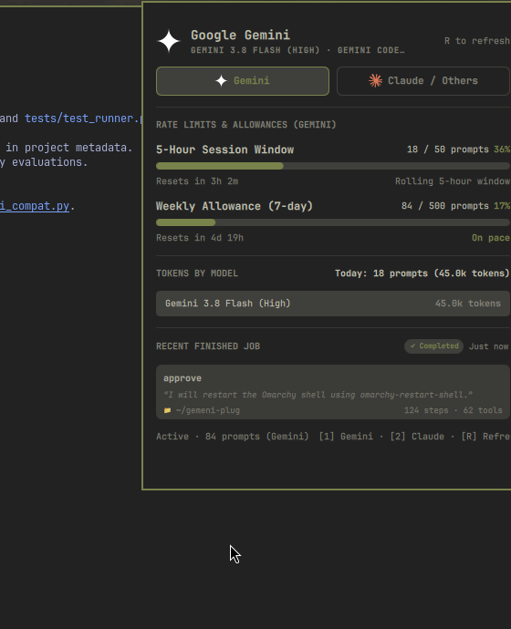

# Gemini & Antigravity Usage for Omarchy

An Omarchy bar widget and details panel for **Google Gemini**, **Claude**, and **Antigravity CLI (`agy`)**. Tracks 5-hour rolling session allowances and 7-day weekly allowances for **Gemini** and **Claude / Others** directly from your Omarchy bar.



## What it shows

### In the Omarchy Bar
- **Dynamic Active Icon**: Displays native Gemini sparkle or Claude icon based on which model is active.
- **Session Allowance & Pace**: Current rolling window usage percentage and time until next reset (e.g. `Gemini 28% · 1h 54m`).
- **Urgent / Behind Pace Indicator**: Turns warning/urgent color when quota consumption is tracking ahead of expected time pace or nearing limits (>85%) across either category.
- **Comprehensive Tooltip**: Hover to see both Gemini and Claude / Others 5-hour usage at a glance.

### In the Details Panel (Left Click)
- **Hero Card**: Provider mark, active model (e.g. `Gemini 3.8 Flash (High)` or `Claude Opus 4.6 (Thinking)`), account tier (`Gemini Code Assist` / `Antigravity`).
- **Two-Category Switcher**: Segmented pills allowing instant toggling between **Gemini** and **Claude / Others** (press `1` for Gemini, `2` for Claude / Others).
- **5-Hour Rolling Session Meter**: Visual gauge, prompt count (e.g. `16 / 50 prompts`), remaining allowance percentage, and countdown to window reset (`Resets in Xh Ym`).
- **7-Day Weekly Meter & Pace**: Visual gauge, weekly allowance (e.g. `82 / 500 prompts`), remaining countdown (`Resets in Xd Yh`), and pace indicator (`On pace` vs `Behind pace`).
- **Tokens by Model**: Clean breakdown of token consumption by model for the selected category.
- **Recent Finished Job**: Dedicated card tracking the latest completed Antigravity task with status badge, execution timestamp, task prompt, target workspace, total steps & tool calls, and result summary.

### Built-in `omarchy.agents` Integration
Every refresh automatically syncs authoritative `gemini.json` and `claude.json` records into `~/.local/state/omarchy/agents/usage/`. Both Gemini and Claude tabs in Omarchy's built-in `omarchy.agents` panel will display rolling 5-hour and 7-day rate limits!

---

## Controls & Keybindings

- **Left-click bar widget**: Open or close the details panel.
- **Right-click or Middle-click bar widget**: Force an immediate refresh.
- **Press `1`**: Switch view to Gemini.
- **Press `2`**: Switch view to Claude / Others.
- **Press `R`**: Refresh stats.
- **Press `Esc`**: Close panel.
- **IPC Support**:
  ```bash
  omarchy-shell gemini-usage open
  omarchy-shell gemini-usage close
  omarchy-shell gemini-usage toggle
  omarchy-shell gemini-usage refresh
  omarchy-shell gemini-usage status
  ```

---

## Configuration

Settings can be customized directly or via `omarchy bar set`:

```bash
# Set refresh interval (in seconds, default: 300)
omarchy bar set gemini-usage refreshIntervalSec 180 --json

# Set Gemini 5-hour session prompt allowance (default: 50)
omarchy bar set gemini-usage sessionAllowance 60 --json

# Set Gemini weekly prompt allowance (default: 500)
omarchy bar set gemini-usage weeklyAllowance 600 --json

# Set Claude / Others 5-hour session prompt allowance (default: 50)
omarchy bar set gemini-usage claudeSessionAllowance 40 --json

# Set Claude / Others weekly prompt allowance (default: 500)
omarchy bar set gemini-usage claudeWeeklyAllowance 400 --json
```

---

## Requirements

- **Omarchy Quattro** with Quickshell plugin support.
- **Python 3** (included in Arch / Omarchy).
- Authenticated **Antigravity (`agy`)** or **Gemini CLI** on the machine.

---

## Removal

To remove the plugin from Omarchy:

```bash
omarchy plugin remove gemini-usage
```

---

## License

MIT © pilppilo
